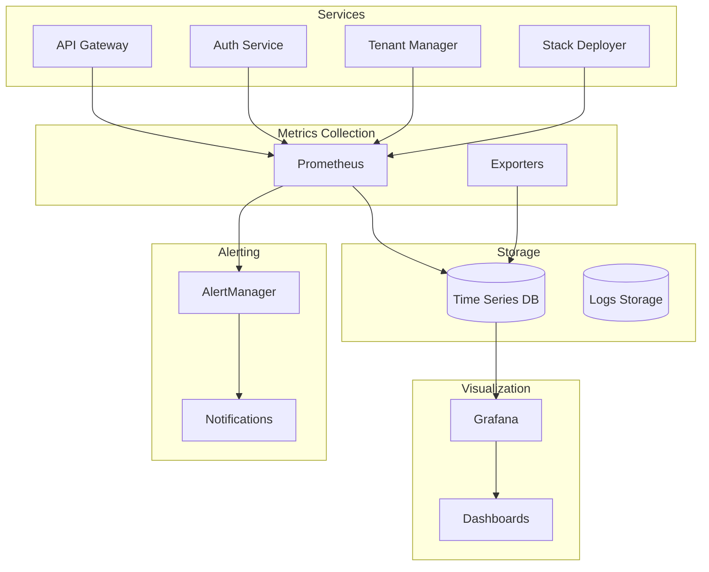

# 📊 Monitoring Service (Prometheus/Grafana) - v3.0

**Componente**: Monitoring Service
**Tecnologia**: Prometheus + Grafana + AlertManager
**Status**: 🚧 Em Desenvolvimento
**Prazo**: 8 dias
**Versão**: 1.0.0

---

## 🎯 VISÃO GERAL

O **Monitoring Service** é responsável pela observabilidade completa da plataforma NEO_STACK v3.0. Coleta métricas, logs e traces de todos os microservices, providing real-time dashboards, alerting e analytics.

---

## 🏗️ ARQUITETURA



---

## 📦 COMPONENTES

### **1. Prometheus**
- Metrics collection
- Time-series database
- PromQL queries
- Service discovery
- Recording rules
- Alerting rules

### **2. Grafana**
- Dashboards
- Visualization
- Multi-tenant dashboards
- Alerting UI
- User management
- Data sources

### **3. AlertManager**
- Alert routing
- Notifications
- Escalation policies
- Silence management
- Inhibition rules

### **4. Exporters**
- Node Exporter (system metrics)
- cAdvisor (container metrics)
- PostgreSQL Exporter
- Redis Exporter
- Custom exporters

---

## 🛠️ IMPLEMENTAÇÃO

### **Estrutura do Projeto**

```
monitoring/
├── prometheus/
│   ├── prometheus.yml
│   ├── recording_rules.yml
│   ├── alerting_rules.yml
│   └── targets/
├── grafana/
│   ├── dashboards/
│   ├── datasources/
│   └── provisioning/
├── alertmanager/
│   ├── alertmanager.yml
│   └── templates/
├── exporters/
│   ├── node_exporter/
│   ├── cAdvisor/
│   └── custom/
├── docker/
│   └── docker-compose.yml
├── k8s/
│   └── manifests/
├── scripts/
│   ├── setup.sh
│   ├── backup.sh
│   └── restore.sh
├── docs/
│   ├── dashboards.md
│   └── alerting.md
└── README.md
```

---

## 📊 DASHBOARDS

### **1. Platform Overview**
- System health
- Service status
- Request rates
- Error rates
- Response times

### **2. API Gateway Dashboard**
- Request metrics
- Rate limiting
- Latency P50, P95, P99
- Error rates
- Top endpoints

### **3. Auth Service Dashboard**
- Login success/failure rates
- Token generation
- Active sessions
- MFA usage
- LDAP sync status

### **4. Tenant Manager Dashboard**
- Tenant creation rate
- Active tenants
- Resource usage
- Database connections
- Query performance

### **5. Infrastructure Dashboard**
- CPU usage
- Memory usage
- Disk I/O
- Network I/O
- Container stats

---

## 🚨 ALERTAS

### **Critical Alerts**
- Service down
- High error rate (>5%)
- High latency (>2s)
- Disk space (>90%)
- Memory usage (>90%)

### **Warning Alerts**
- High CPU usage (>80%)
- Disk space (>80%)
- Certificate expiring (30 days)
- Database connections (>80%)

### **Info Alerts**
- Service deployments
- Configuration changes
- Backup completions

---

## 📈 MÉTRICAS

### **Application Metrics**
```promql
# Request rate
rate(http_requests_total[5m])

# Error rate
rate(http_requests_total{status=~"5.."}[5m]) / rate(http_requests_total[5m])

# Response time
histogram_quantile(0.95, rate(http_request_duration_seconds_bucket[5m]))

# Active connections
sum by (service) (pg_stat_database_numbackends)

# Database queries
rate(pg_stat_database_tup_returned[5m])
```

### **Infrastructure Metrics**
```promql
# CPU usage
100 - (avg by (instance) (irate(node_cpu_seconds_total{mode="idle"}[5m])) * 100)

# Memory usage
100 * (1 - (node_memory_MemAvailable_bytes / node_memory_MemTotal_bytes))

# Disk usage
100 * (1 - (node_filesystem_avail_bytes / node_filesystem_size_bytes))

# Network traffic
rate(node_network_receive_bytes_total[5m])
rate(node_network_transmit_bytes_total[5m])
```

### **Business Metrics**
```promql
# Active tenants
count(tenant_manager_tenants{status="active"})

# New tenants per day
increase(tenant_manager_tenants_created[1d])

# Resource usage
sum by (resource_type) (tenant_manager_resource_usage)

# Billing metrics
rate(billing_invoices_total[1d])
```

---

## 🔐 SEGURANÇA

### **Authentication**
- Grafana with Authentik SSO
- Role-based access control
- API token management

### **Authorization**
- Per-tenant dashboards
- Data isolation
- Query restrictions

### **TLS**
- Grafana over HTTPS
- Prometheus secure endpoints
- AlertManager notifications

---

## 🧪 TESTES

### **Dashboard Tests**
```python
import pytest
from grafana_api.grafana_face import GrafanaFace

@pytest.fixture
def grafana():
    return GrafanaFace(auth=("admin", "admin"))

def test_dashboard_exists(grafana):
    dashboards = grafana.dashboard.dashboard()
    assert "platform-overview" in dashboards

def test_alerts_configured(grafana):
    alerts = grafana.alerts.get_alerts()
    assert len(alerts) > 0
```

---

## 🚀 DEPLOYMENT

### **Docker Compose**

```yaml
version: '3.8'

services:
  prometheus:
    image: prom/prometheus:latest
    ports:
      - "9090:9090"
    volumes:
      - ./prometheus:/etc/prometheus
      - prometheus_data:/prometheus
    command:
      - '--config.file=/etc/prometheus/prometheus.yml'
      - '--storage.tsdb.path=/prometheus'
      - '--web.console.libraries=/etc/prometheus/console_libraries'
      - '--web.console.templates=/etc/prometheus/consoles'
      - '--web.enable-lifecycle'
    networks:
      - monitoring

  grafana:
    image: grafana/grafana:latest
    ports:
      - "3000:3000"
    environment:
      GF_SECURITY_ADMIN_PASSWORD: admin
      GF_INSTALL_PLUGINS: grafana-piechart-panel
    volumes:
      - grafana_data:/var/lib/grafana
      - ./grafana/provisioning:/etc/grafana/provisioning
    networks:
      - monitoring

  alertmanager:
    image: prom/alertmanager:latest
    ports:
      - "9093:9093"
    volumes:
      - ./alertmanager:/etc/alertmanager
    networks:
      - monitoring
```

---

## 📚 REFERÊNCIAS

- [Prometheus Documentation](https://prometheus.io/docs/)
- [Grafana Documentation](https://grafana.com/docs/)
- [AlertManager Documentation](https://prometheus.io/docs/alerting/latest/alertmanager/)
- [Node Exporter](https://github.com/prometheus/node_exporter)
- [cAdvisor](https://github.com/google/cadvisor)

---

## ✅ PRÓXIMOS PASSOS

1. 🚧 **Configurar Prometheus**
2. 🚧 **Criar dashboards Grafana**
3. 🚧 **Configurar AlertManager**
4. 🚧 **Setup exporters**
5. 🚧 **Criar alerting rules**
6. 🚧 **Configurar notificações**
7. 🚧 **Setup multi-tenancy**
8. 🚧 **Deploy em Kubernetes**

---

**Status**: 🚧 **Em Desenvolvimento - Sprint 11**
**Próximo**: Implementar Billing Service (Stripe)
**Prazo**: 8 dias
