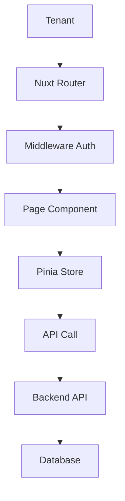

# 🏢 Tenant Portal - NEO_STACK Platform v3.0

## 📋 Índice

1. [Visão Geral](#visão-geral)
2. [Funcionalidades](#funcionalidades)
3. [Instalação](#instalação)
4. [Configuração](#configuração)
5. [Uso](#uso)
6. [Arquitetura](#arquitetura)
7. [Contribuição](#contribuição)

---

## 🎯 Visão Geral

O **Tenant Portal** é uma interface completa desenvolvida em Vue 3 + Nuxt 3 + Nuxt UI para o NEO_STACK Platform v3.0. Ele fornece aos tenants uma interface intuitiva para gerenciarem sua própria assinatura, recursos, usuários, faturas e configurações.

### ✨ Características Principais

- **🎨 Interface Intuitiva**: Desenvolvido com Nuxt UI
- **⚡ Performance**: Renderização server-side com Nuxt 3
- **📱 Responsivo**: Design mobile-first
- **🔐 Seguro**: Autenticação JWT
- **📊 Métricas**: Dashboard com gráficos em tempo real
- **🌍 Bilíngue**: Suporte PT-BR e ES-MX
- **🎯 TypeScript**: Type safety completo
- **📦 State Management**: Pinia para gerenciamento de estado

---

## 🎯 Funcionalidades

### 1. **Dashboard**
- Visão geral da assinatura
- Métricas de uso em tempo real
- Alertas de limites
- Atividade recente
- Ações rápidas

### 2. **Gerenciamento de Assinatura**
- Visualizar plano atual
- Alterar plano
- Cancelar/retomar assinatura
- Ver período de teste
- Detalhes de renovação

### 3. **Billing e Faturas**
- Listar faturas
- Pagar faturas online
- Download de PDFs
- Métodos de pagamento
- Histórico de pagamentos
- Exportação de dados

### 4. **Uso e Limites**
- Monitorar uso de recursos
- API calls
- Storage
- Usuários
- Dispositivos
- Gráficos de histórico
- Alertas de limite

### 5. **Gerenciamento de Usuários**
- Listar usuários do tenant
- Adicionar/remover usuários
- Gerenciar permissões
- Ativar/desativar contas

### 6. **Recursos**
- Gerenciar recursos do tenant
- Configurações
- Integrações

### 7. **Configurações**
- Perfil do tenant
- Configurações de conta
- Preferências
- Configurações de notificação

---

## 📦 Instalação

### Pré-requisitos

- Node.js 18+
- npm ou yarn
- Docker (opcional)

### Instalação Rápida

```bash
# Clone o repositório
git clone https://github.com/your-org/neo_netbox_odoo_stack.git
cd neo_netbox_odoo_stack/platform/tenant-portal

# Execute o setup
chmod +x scripts/setup.sh
./scripts/setup.sh
```

### Instalação Manual

```bash
# 1. Instalar dependências
npm install

# 2. Configurar variáveis de ambiente
cp .env.example .env
# Editar .env com suas configurações

# 3. Executar em modo desenvolvimento
npm run dev

# 4. Build para produção
npm run build
npm run preview
```

### Instalação com Docker

```bash
# Build e start dos containers
cd docker
docker-compose up -d

# Verificar logs
docker-compose logs -f tenant-portal
```

---

## ⚙️ Configuração

### Variáveis de Ambiente

```env
# URLs dos Serviços
API_BASE_URL=http://localhost:8000
AUTH_URL=http://localhost:8080
BILLING_URL=http://localhost:8000
NETBOX_URL=http://localhost:8001
ODOO_URL=http://localhost:8069

# Aplicação
NODE_ENV=production
NUXT_PORT=3003

# Segurança
SESSION_SECRET=your-session-secret-change-me
```

---

## 📖 Uso

### Desenvolvimento

```bash
# Servidor de desenvolvimento
npm run dev

# Type checking
npm run type-check

# Linting
npm run lint
npm run lint:fix
```

### Build e Deploy

```bash
# Build para produção
npm run build

# Preview da build
npm run preview
```

### Estrutura do Projeto

```
tenant-portal/
├── assets/              # Assets estáticos
├── components/          # Componentes Vue
├── layouts/             # Layouts de página
├── middleware/          # Middleware
├── pages/               # Páginas da aplicação
├── stores/              # Stores Pinia
├── types/               # Definições TypeScript
└── docs/                # Documentação
```

---

## 🏗️ Arquitetura

### Fluxo de Dados



### State Management

```typescript
// stores/auth.ts
export const useAuthStore = defineStore('auth', {
  state: (): AuthState => ({
    user: null,
    tenant: null,
    token: null,
    isAuthenticated: false,
  }),

  getters: {
    currentTenant: (state) => state.tenant,
  },
})
```

---

## 🔌 API

### Endpoints

#### Autenticação

```
POST /api/auth/login
POST /api/auth/logout
GET  /api/auth/me
```

#### Subscription

```
GET  /api/v1/subscriptions/current
PUT  /api/v1/subscriptions/current
GET  /api/v1/plans
```

#### Billing

```
GET  /api/v1/invoices
GET  /api/v1/invoices/:id
GET  /api/v1/payment-methods
POST /api/v1/payment-methods
```

#### Usage

```
GET  /api/v1/usage/summary
POST /api/v1/usage
```

---

## 🚀 Deployment

### Docker

```bash
# Build da imagem
docker build -t neo-stack-tenant-portal .

# Executar container
docker run -p 3003:3003 neo-stack-tenant-portal
```

### Docker Compose

```bash
cd docker
docker-compose up -d
```

### Produção

```bash
# Build otimizada
npm run build

# Servir com PM2
pm2 start .output/server/index.mjs --name tenant-portal
```

---

## 🔒 Segurança

- **JWT Authentication**: Tokens seguros
- **Role-Based Access**: Verificação de tenant
- **CSRF Protection**: Tokens de validação
- **Input Validation**: Validação de dados

---

## 🧪 Testes

```bash
# Executar testes
npm run test

# Coverage
npm run test:coverage
```

---

## 🤝 Contribuição

### Desenvolvimento

```bash
# Setup ambiente dev
npm install

# Executar em modo desenvolvimento
npm run dev

# Executar testes
npm run test

# Linting
npm run lint
npm run lint:fix
```

### Convenções

- **Commits**: Use Conventional Commits
- **Branches**: feature/, bugfix/, hotfix/
- **Código**: ESLint + Prettier
- **Types**: TypeScript obrigatório

---

## 📄 Licença

MIT License - see [LICENSE](LICENSE) file for details.

---

## 📞 Suporte

- **Email**: tenant-support@platform.local
- **Slack**: #tenant-portal
- **Issues**: https://github.com/your-org/neo_netbox_odoo_stack/issues

---

**Desenvolvido com ❤️ para o NEO_STACK Platform v3.0**
