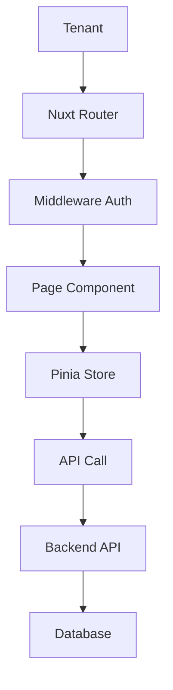

# 🏢 Tenant Portal - NEO_STACK Platform v3.0

## 📋 Índice

1. [Resumen General](#resumen-general)
2. [Funcionalidades](#funcionalidades)
3. [Instalación](#instalación)
4. [Configuración](#configuración)
5. [Uso](#uso)
6. [Arquitectura](#arquitectura)
7. [Contribución](#contribución)

---

## 🎯 Resumen General

El **Tenant Portal** es una interfaz completa desarrollada en Vue 3 + Nuxt 3 + Nuxt UI para NEO_STACK Platform v3.0. Proporciona a los tenants una interfaz intuitiva para gestionar su propia suscripción, recursos, usuarios, facturas y configuraciones.

### ✨ Características Principales

- **🎨 Interfaz Intuitiva**: Desarrollado con Nuxt UI
- **⚡ Rendimiento**: Renderizado del lado del servidor con Nuxt 3
- **📱 Responsivo**: Diseño mobile-first
- **🔐 Seguro**: Autenticación JWT
- **📊 Métricas**: Dashboard con gráficos en tiempo real
- **🌍 Bilingüe**: Soporte PT-BR y ES-MX
- **🎯 TypeScript**: Type safety completo
- **📦 State Management**: Pinia para gestión de estado

---

## 🎯 Funcionalidades

### 1. **Dashboard**
- Visión general de la suscripción
- Métricas de uso en tiempo real
- Alertas de límites
- Actividad reciente
- Acciones rápidas

### 2. **Gestión de Suscripción**
- Ver plan actual
- Cambiar plan
- Cancelar/reanudar suscripción
- Ver período de prueba
- Detalles de renovación

### 3. **Facturación y Facturas**
- Listar facturas
- Pagar facturas online
- Descargar PDFs
- Métodos de pago
- Historial de pagos
- Exportación de datos

### 4. **Uso y Límites**
- Monitorear uso de recursos
- Llamadas API
- Storage
- Usuarios
- Dispositivos
- Gráficos de historial
- Alertas de límite

### 5. **Gestión de Usuarios**
- Listar usuarios del tenant
- Agregar/remover usuarios
- Gestionar permisos
- Activar/desactivar cuentas

### 6. **Recursos**
- Gestionar recursos del tenant
- Configuraciones
- Integraciones

### 7. **Configuraciones**
- Perfil del tenant
- Configuraciones de cuenta
- Preferencias
- Configuraciones de notificación

---

## 📦 Instalación

### Prerrequisitos

- Node.js 18+
- npm o yarn
- Docker (opcional)

### Instalación Rápida

```bash
# Clonar el repositorio
git clone https://github.com/your-org/neo_netbox_odoo_stack.git
cd neo_netbox_odoo_stack/platform/tenant-portal

# Ejecutar setup
chmod +x scripts/setup.sh
./scripts/setup.sh
```

### Instalación Manual

```bash
# 1. Instalar dependencias
npm install

# 2. Configurar variables de entorno
cp .env.example .env
# Editar .env con tus configuraciones

# 3. Ejecutar en modo desarrollo
npm run dev

# 4. Build para producción
npm run build
npm run preview
```

### Instalación con Docker

```bash
# Build y start de los containers
cd docker
docker-compose up -d

# Verificar logs
docker-compose logs -f tenant-portal
```

---

## ⚙️ Configuración

### Variables de Entorno

```env
# URLs de los Servicios
API_BASE_URL=http://localhost:8000
AUTH_URL=http://localhost:8080
BILLING_URL=http://localhost:8000
NETBOX_URL=http://localhost:8001
ODOO_URL=http://localhost:8069

# Aplicación
NODE_ENV=production
NUXT_PORT=3003

# Seguridad
SESSION_SECRET=your-session-secret-change-me
```

---

## 📖 Uso

### Desarrollo

```bash
# Servidor de desarrollo
npm run dev

# Type checking
npm run type-check

# Linting
npm run lint
npm run lint:fix
```

### Build y Deploy

```bash
# Build para producción
npm run build

# Preview del build
npm run preview
```

### Estructura del Proyecto

```
tenant-portal/
├── assets/              # Assets estáticos
├── components/          # Componentes Vue
├── layouts/             # Layouts de página
├── middleware/          # Middleware
├── pages/               # Páginas de la aplicación
├── stores/              # Stores Pinia
├── types/               # Definiciones TypeScript
└── docs/                # Documentación
```

---

## 🏗️ Arquitectura

### Flujo de Datos



### State Management

```typescript
// stores/auth.ts
export const useAuthStore = defineStore('auth', {
  state: (): AuthState => ({
    user: null,
    tenant: null,
    token: null,
    isAuthenticated: false,
  }),

  getters: {
    currentTenant: (state) => state.tenant,
  },
})
```

---

## 🔌 API

### Endpoints

#### Autenticación

```
POST /api/auth/login
POST /api/auth/logout
GET  /api/auth/me
```

#### Suscripción

```
GET  /api/v1/subscriptions/current
PUT  /api/v1/subscriptions/current
GET  /api/v1/plans
```

#### Facturación

```
GET  /api/v1/invoices
GET  /api/v1/invoices/:id
GET  /api/v1/payment-methods
POST /api/v1/payment-methods
```

#### Uso

```
GET  /api/v1/usage/summary
POST /api/v1/usage
```

---

## 🚀 Deployment

### Docker

```bash
# Build de la imagen
docker build -t neo-stack-tenant-portal .

# Ejecutar container
docker run -p 3003:3003 neo-stack-tenant-portal
```

### Docker Compose

```bash
cd docker
docker-compose up -d
```

### Producción

```bash
# Build optimizada
npm run build

# Servir con PM2
pm2 start .output/server/index.mjs --name tenant-portal
```

---

## 🔒 Seguridad

- **JWT Authentication**: Tokens seguros
- **Role-Based Access**: Verificación de tenant
- **CSRF Protection**: Tokens de validación
- **Input Validation**: Validación de datos

---

## 🧪 Tests

```bash
# Ejecutar tests
npm run test

# Coverage
npm run test:coverage
```

---

## 🤝 Contribución

### Desarrollo

```bash
# Setup ambiente dev
npm install

# Ejecutar en modo desarrollo
npm run dev

# Ejecutar tests
npm run test

# Linting
npm run lint
npm run lint:fix
```

### Convenciones

- **Commits**: Use Conventional Commits
- **Branches**: feature/, bugfix/, hotfix/
- **Código**: ESLint + Prettier
- **Types**: TypeScript obligatorio

---

## 📄 Licencia

MIT License - ver [LICENSE](LICENSE) para detalles.

---

## 📞 Soporte

- **Email**: tenant-support@platform.local
- **Slack**: #tenant-portal
- **Issues**: https://github.com/your-org/neo_netbox_odoo_stack/issues

---

**Desarrollado con ❤️ para NEO_STACK Platform v3.0**
